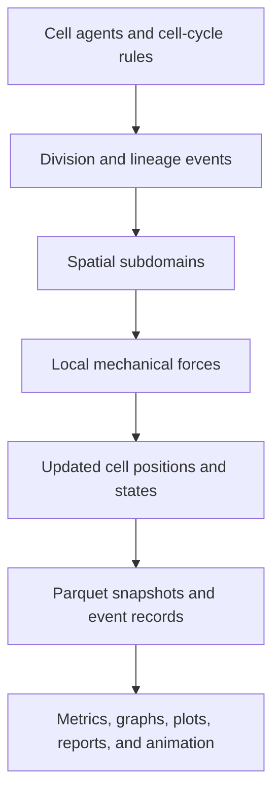

# Yeast Cell Colony ABM

**[Yeast Cell Colony ABM](https://github.com/pearlalmeida17/yeast-cell-colony-ABM)** · **Python · NumPy · SciPy · NetworkX · PyArrow/Parquet · Matplotlib · pandas**

A research-based two-dimensional agent-based model for simulating the growth, division, spatial organization, lineage structure, and mechanical interactions of *Saccharomyces cerevisiae* colonies.

This project is based on the published biophysical model presented in [“Quantifying the Biophysical Impact of Budding Cell Division on the Spatial Organization of Growing Yeast Colonies”](https://doi.org/10.3390/app10175780) by Banwarth-Kuhn, Collignon, and Sindi. The paper’s biological assumptions, division modes, mechanical interactions, spatial organization concepts, and colony-level analysis goals are translated into a modular Python simulation and analysis pipeline.

> **Project status:** The complete paper-based experimental matrix is implemented. Simulations for the remaining conditions and durations are currently running; the final comparison tables and figures will be added to this README as the runs finish.

## Research objective

The model investigates how local cell-level rules generate colony-scale organization. Every cell is represented as an independent agent with its own:

- position, radius, velocity, and growth state;
- stochastic G1/G2 cell-cycle progression;
- budding and mother-daughter attachment state;
- parent, founder, lineage, and subcolony metadata; and
- spatial-subdomain assignment for efficient local interaction calculations.

The simulation is designed to compare budding and non-budding division under nutrient-rich and nutrient-limited conditions at the paper’s relevant growth durations. Outputs support quantitative analysis of cell population growth, colony geometry, spatial connectivity, lineage organization, subcolony structure, and birth-location patterns.

## Model and software architecture



Each simulation step updates biological state, creates daughter cells when division occurs, computes local forces, integrates cell motion, and periodically persists the current state. The active `Cell` objects remain in memory for numerical performance while Parquet stores the reproducible history of the run.

## Technical implementation

- **Agent-based design:** Implemented stateful `Cell` agents with stochastic G1/G2 progression, growth, asymmetric budding, bud-site selection, mother-daughter attachment, bud separation, maturation, and lineage tracking.
- **Biophysical mechanics:** Implemented Hertz-style overlap repulsion, mother-bud spring forces, viscosity-scaled overdamped motion, and forward-Euler position integration.
- **Spatial acceleration:** Partitioned the simulation domain into spatial subdomains and evaluated mechanical interactions only among nearby cells. This reduces the candidate interaction set compared with an all-pairs calculation and improves scalability as the colony grows.
- **Nutrient limitation:** Computed local biomass by subdomain and adjusted growth or cell-cycle progression using normalized nutrient-capacity factors.
- **State and event management:** Recorded cell births, division events, parent-child relationships, bud states, checkpoints, and periodic cell-state snapshots.
- **Persistent storage:** Used typed Parquet files as the computational data source of truth. Excel is generated only as a human-readable analysis report and is not used as the simulation database.
- **Graph-based analysis:** Implemented Delaunay spatial graphs, lineage graphs, spatial-lineage intersection analysis, colony connectivity, and subcolony connected-component analysis.
- **Scientific reproducibility:** Stored random seeds, model parameters, biological conditions, run IDs, and simulation metadata with each experiment.
- **Visualization and reporting:** Added static colony plots, time-series plots, MP4/GIF animation, Parquet metrics, and Excel report generation.

## Paper-based experimental matrix

The implementation supports the principal division and nutrient conditions represented in the paper:

| Condition | `BUDDING` | `NUTRIENT_LIMITED` | Scientific comparison |
|---|---:|---:|---|
| Budding, nutrient-rich | `True` | `False` | Reference budding-colony growth |
| Non-budding, nutrient-rich | `False` | `False` | Effect of division geometry without budding |
| Budding, nutrient-limited | `True` | `True` | Effect of local nutrient limitation during budding |
| Non-budding, nutrient-limited | `False` | `True` | Combined division-mode and nutrient-limitation comparison |

The experiments are configured for paper-relevant durations of approximately **12, 18, 24, and 28 hours**. These correspond to the population-growth and colony-organization regimes discussed or shown in the paper.

### Results tracking

The following table is intentionally structured for completion as the current simulation runs finish:

| Division mode | Nutrient condition | 12 h | 18 h | 24 h | 28 h |
|---|---|---:|---:|---:|---:|
| Budding | Nutrient-rich | 114 verified | Pending | Pending | Pending |
| Non-budding | Nutrient-rich | Pending | Pending | Pending | Pending |
| Budding | Nutrient-limited | Pending | Pending | Pending | Pending |
| Non-budding | Nutrient-limited | Pending | Pending | Pending | Pending |

The verified reference run used a fixed seed and produced:

```text
Simulation duration: 720 minutes
Condition: budding, nutrient-rich
Final cell count: 114
```

This is consistent with the paper’s approximate 12-hour population scale of roughly 100–120 cells. The remaining result cells should be replaced with the measured final populations and relevant metric summaries after the corresponding runs complete.

## Colony metrics and analysis

The analysis pipeline is designed to reproduce the paper’s colony-level comparisons and extend them with stored, reproducible outputs. Current metrics and analyses include:

- cell count and population growth over time;
- colony area, expanse, center of mass, and sparsity;
- normalized birth location and spatial distributions;
- Delaunay spatial-neighbor relationships;
- lineage and mother-daughter connectivity;
- spatial-lineage intersection graphs;
- colony connectivity and connected components;
- subcolony membership and connected-component structure;
- comparison of budding versus non-budding simulations; and
- comparison of nutrient-rich versus nutrient-limited simulations.

Run analysis with:

```bash
python -m src.experiments.analyze_run data/runs/run_XXXXXXXXXX
```

The analysis command reads the stored snapshots and generates outputs such as:

```text
metrics.parquet
report.xlsx
paper_metrics.png
```

## Project structure

```text
cell-sim/
├── data/
│   ├── inputs/
│   │   └── initial_cells.parquet
│   └── runs/<run_id>/
│       ├── metadata.json
│       ├── cell_births.parquet
│       ├── events.parquet
│       ├── metrics.parquet
│       ├── report.xlsx
│       ├── checkpoint_*.parquet
│       └── snapshots/part-*.parquet
├── src/
│   ├── config/                 # Simulation and biological parameters
│   ├── core/                   # Cells, cycles, budding, rules, forces
│   ├── storage/                # Parquet schema, loaders, and persistence
│   ├── analysis/               # Metrics, graphs, plots, exports, animation
│   ├── simulation/             # Simulation engine and time stepping
│   └── experiments/            # Run, batch, and analysis entry points
├── requirements.txt
└── README.md
```

## Installation

Create and activate a virtual environment:

```bash
python -m venv .venv
```

Windows PowerShell:

```powershell
.venv\Scripts\Activate.ps1
```

macOS/Linux:

```bash
source .venv/bin/activate
```

Install the dependencies:

```bash
pip install -r requirements.txt
```

## Run a simulation

From the repository root:

```bash
python -m src.experiments.main
```

Each run creates a unique directory under `data/runs/` and prints its identifier:

```text
Run ID: run_XXXXXXXXXX
Final cell count: 114
```

Configure the biological condition and duration in `src/config/base_config.py`:

```python
total_time: float = 1440
BUDDING = True
NUTRIENT_LIMITED = False
```

For reproducibility, use a fixed seed when running experiments. The seed and configuration values are written to `metadata.json`.

## Storage design

The simulation uses the following data flow:

```text
initial_cells.parquet  → initial simulation state
cell_births.parquet    → permanent cell-creation records
events.parquet         → biological and simulation events
snapshots/*.parquet    → time-dependent cell states
checkpoint_*.parquet   → optional recovery states
metadata.json          → seed, parameters, and run conditions
```

Parquet is used because it provides a typed, columnar representation that is efficient for large simulation outputs and analysis queries. The in-memory cell array remains the active numerical state during a run; snapshots provide durable historical states for metrics, plotting, visualization, and animation.

Checkpoints are optional periodic state files. They preserve the simulation state at selected times and can support recovery or inspection of long-running experiments. Snapshots are the primary input for post-run analysis and animation.

## Animation and visualization

With FFmpeg installed, create an MP4 animation from saved snapshots:

```powershell
python -c "from src.analysis.visualize import animate_run; animate_run('data/runs/run_XXXXXXXXXX', 'data/runs/run_XXXXXXXXXX/colony.mp4')"
```

If FFmpeg is unavailable, create a GIF instead:

```powershell
python -c "from src.analysis.visualize import animate_run; animate_run('data/runs/run_XXXXXXXXXX', 'data/runs/run_XXXXXXXXXX/colony.gif')"
```

The animation reads stored snapshots and does not rerun the simulation. Colony colors represent stored subcolony or lineage-group assignments; these assignments should be inspected from the Parquet records rather than inferred only from the number of visible colors.

## Reproducibility and experiment workflow


Recommended workflow:

1. Set `BUDDING`, `NUTRIENT_LIMITED`, and `total_time`.
2. Run the simulation with a recorded seed.
3. Save the printed `run_id`.
4. Analyze the run using the stored Parquet snapshots.
5. Generate plots, reports, and animation from the same run directory.
6. Add the final cell-count and metric results to the results table above.

## Scope and limitations

This project is a two-dimensional computational implementation of the published model. It uses simplified nutrient dynamics, overdamped mechanics, periodic snapshots, and discrete time integration. The experimental matrix covers the paper-based division, nutrient, and duration scenarios, but the implementation does not currently model full nutrient diffusion, cell death, rotational forces, three-dimensional colony structure, or every known yeast budding strategy.

## Citation

Banwarth-Kuhn, M., Collignon, J., & Sindi, S. (2020). Quantifying the Biophysical Impact of Budding Cell Division on the Spatial Organization of Growing Yeast Colonies. *Applied Sciences, 10*(17), 5780. https://doi.org/10.3390/app10175780

## Acknowledgment

This project was developed as a research implementation and computational extension of the published model above, with the goal of studying how cell-cycle behavior, division geometry, nutrient availability, and local mechanics influence the organization of growing yeast colonies.